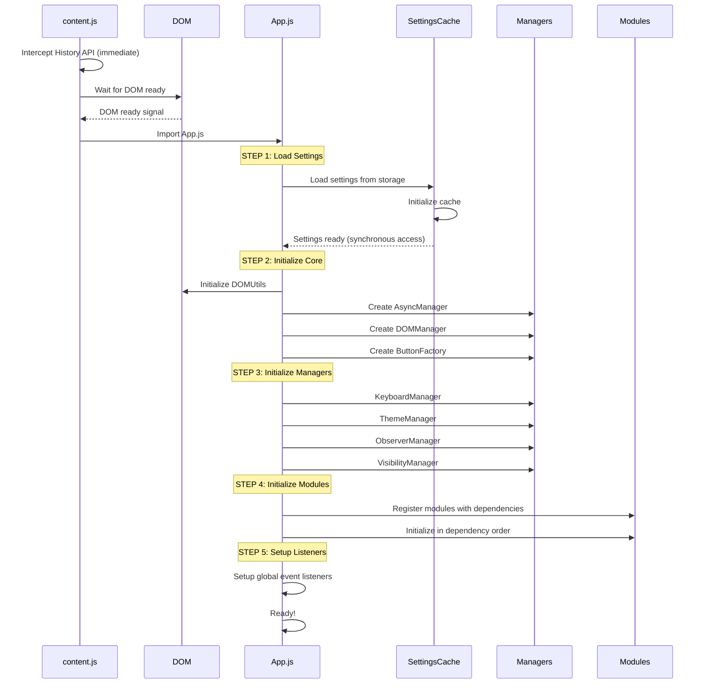
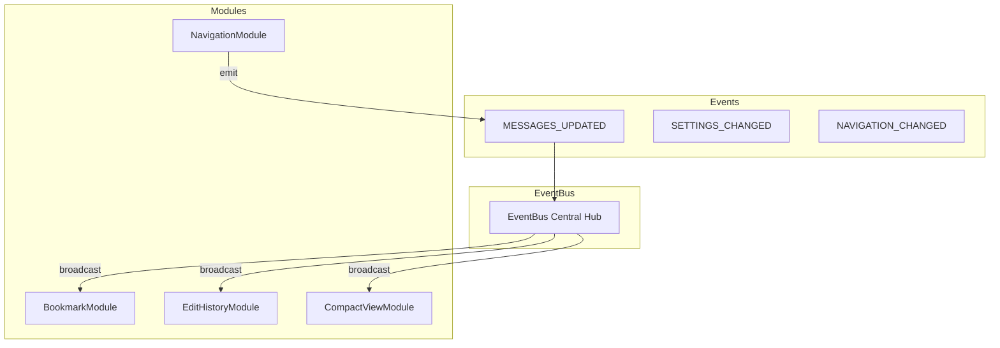
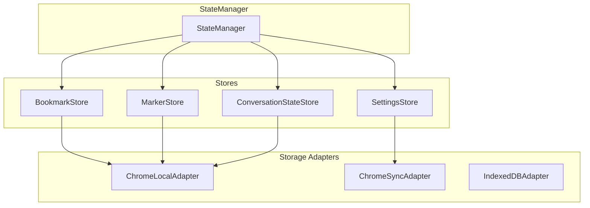
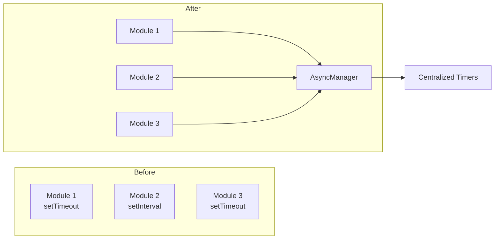
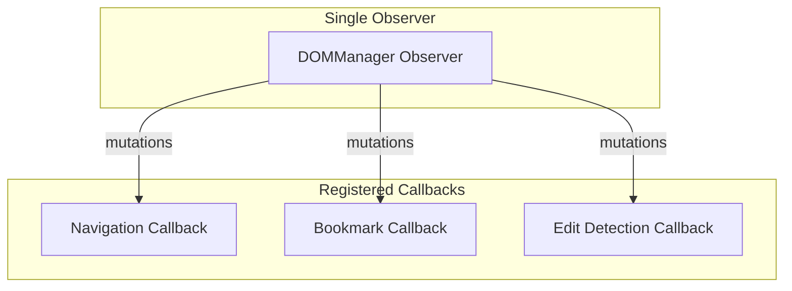
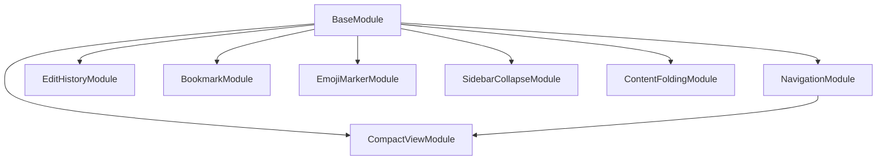
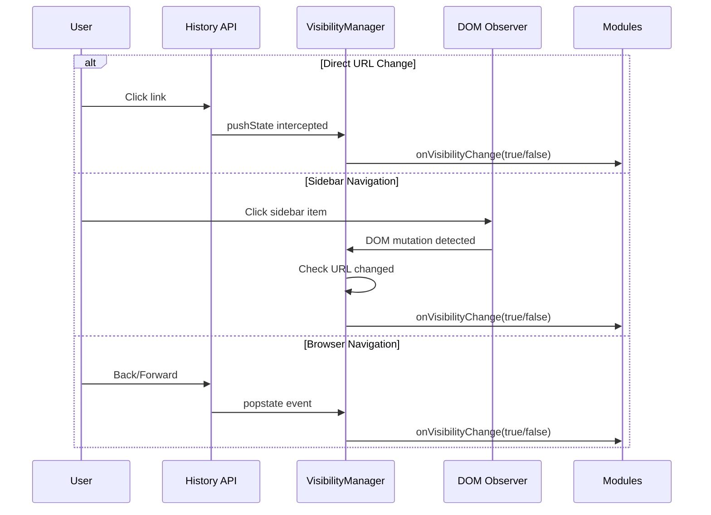
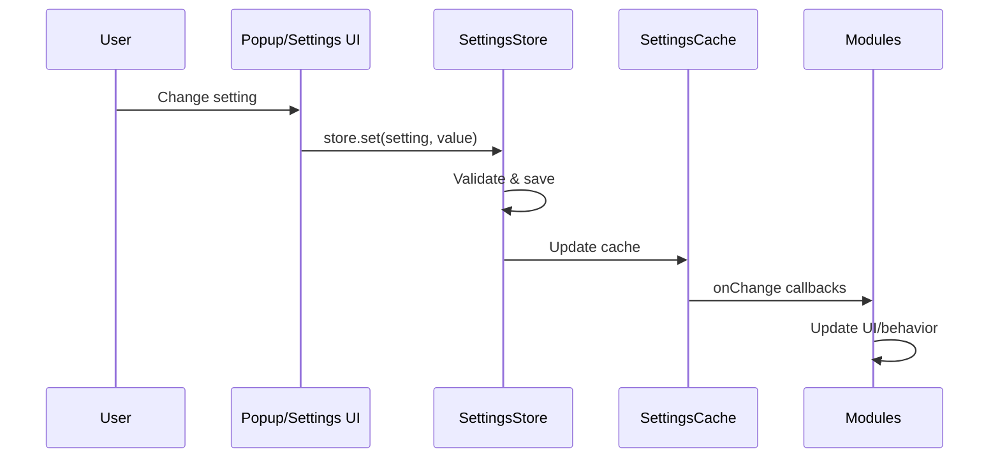

# Claude Productivity Extension - System Architecture

## Table of Contents
1. [Overview](#overview)
2. [Initialization Flow](#initialization-flow)
3. [Module Communication](#module-communication)
4. [State Management](#state-management)
5. [Async Operations](#async-operations)
6. [DOM Operations](#dom-operations)
7. [Component Hierarchy](#component-hierarchy)
8. [Event Flow](#event-flow)

---

## Overview

The Claude Productivity Extension is a Chrome extension that enhances the Claude.ai web interface with productivity features. The architecture follows a centralized manager pattern with event-driven communication.

### Key Principles
- **Centralized Management**: Core functionality is handled by specialized managers
- **Event-Driven Architecture**: Modules communicate via EventBus
- **No Polling**: All operations are event-driven, no setInterval/polling
- **Synchronous Settings**: Settings cached for instant access
- **Memory Efficient**: WeakMaps for caching, proper cleanup

---

## Initialization Flow



### Initialization Sequence Details

1. **content.js Entry Point**
   - Intercepts History API immediately (before Claude.ai can override)
   - Waits for DOM to be ready before loading modules
   - Imports App.js only after DOM is ready

2. **Settings Load (Critical First Step)**
   - Settings loaded before any other initialization
   - SettingsCache initialized with loaded settings
   - All components have synchronous access to settings

3. **Core Infrastructure**
   - AsyncManager: Centralized timer/async management
   - DOMManager: Centralized DOM operations
   - ButtonFactory: Unified button creation
   - SettingsCache: Synchronous settings access

4. **Manager Initialization**
   - Managers initialized with settings available
   - Each manager handles specific concerns
   - No cross-dependencies between managers

5. **Module Registration & Initialization**
   - Modules registered with dependency metadata
   - Topological sort ensures correct init order
   - Each module initialized with all dependencies ready

---

## Module Communication

### EventBus Pattern



### Event Types

```javascript
// Core Events
Events.SETTINGS_CHANGED    // Settings updated
Events.MESSAGES_UPDATED    // Message list changed
Events.NAVIGATION_CHANGED  // Page navigation occurred

// Module-Specific Events
Events.BOOKMARK_ADDED      // Bookmark created
Events.BOOKMARK_REMOVED    // Bookmark deleted
Events.MARKER_ADDED        // Emoji marker added
Events.EDIT_DETECTED       // Edit version found
```

---

## State Management

### Store Architecture



### Store Features
- **Caching**: 5-30 second TTL based on data type
- **Validation**: Schema validation on all operations
- **Reactivity**: EventEmitter for change notifications
- **Cross-Tab Sync**: Automatic sync via chrome.storage.onChanged

### Data Flow

```javascript
// Write Operation
Module -> Store.set() -> Validation -> Adapter -> Storage -> Cache Update -> Event Emission

// Read Operation (Cache Hit)
Module -> Store.get() -> Cache Check (HIT) -> Return Data

// Read Operation (Cache Miss)
Module -> Store.get() -> Cache Check (MISS) -> Adapter -> Storage -> Cache Update -> Return Data
```

---

## Async Operations

### AsyncManager Centralization



### AsyncManager Features

```javascript
// Timer Management
asyncManager.setTimeout(callback, delay, 'description')
asyncManager.setInterval(callback, interval, 'description')
asyncManager.clearTimer(timerId)

// Event-Driven Element Waiting (No Polling!)
await asyncManager.waitForElement('.selector', timeout)

// Promise Management
await asyncManager.withTimeout(asyncFn, 30000, 'operation')
await asyncManager.deduplicate('key', asyncFn)
await asyncManager.retry(asyncFn, 3, 1000, 'operation')

// Function Utilities
const throttled = asyncManager.throttle(fn, 300)
const debounced = asyncManager.debounce(fn, 500)
```

---

## DOM Operations

### DOMManager Centralization



### DOMManager Features

```javascript
// Safe Element Creation (No innerHTML!)
domManager.createElement('div', {
    className: 'my-class',
    style: { color: 'red' },
    onclick: handler
}, 'content')

// Cached Queries
domManager.querySelector('.selector', root, useCache)
domManager.querySelectorAll('.selector', root, useCache)

// Safe HTML Setting
domManager.setHTML(element, html, sanitize = true)

// Observer Registration
domManager.observe('unique-id', '.selector', callback)
```

---

## Component Hierarchy

### Module Structure

```
src/
├── managers/                    # Centralized Managers (NEW)
│   ├── AsyncManager.js          # All async operations
│   ├── DOMManager.js            # All DOM operations
│   ├── KeyboardManager.js       # Global keyboard shortcuts
│   ├── ThemeManager.js          # Theme management
│   └── ObserverManager.js       # Observer lifecycle
├── factories/                   # Object Factories (NEW)
│   └── ButtonFactory.js         # Unified button creation
├── core/                        # Core Infrastructure
│   ├── SettingsCache.js         # Synchronous settings (NEW)
│   ├── StateManager.js          # Store management
│   ├── EventEmitter.js          # Reactive events
│   ├── FixedButtonMixin.js      # Button behavior
│   ├── BasePanel.js             # Panel base class
│   ├── MessageObserverMixin.js  # Observer pattern
│   └── storage/
│       ├── Store.js             # Base store class
│       └── adapters/            # Storage adapters
├── stores/                      # Data Stores
│   ├── SettingsStore.js
│   ├── BookmarkStore.js
│   ├── MarkerStore.js
│   └── ConversationStateStore.js
├── modules/                     # Feature Modules
│   ├── BaseModule.js
│   ├── NavigationModule.js
│   ├── EditHistoryModule.js
│   ├── CompactViewModule.js
│   ├── BookmarkModule.js
│   ├── EmojiMarkerModule.js
│   ├── SidebarCollapseModule.js
│   └── ContentFoldingModule.js
└── App.js                       # Main application
```

### Module Dependencies



---

## Event Flow

### Navigation Detection



### Settings Update Flow



---

## Performance Optimizations

### Before Refactoring
- **150 operations/minute** from polling intervals
- **Multiple MutationObservers** (one per module)
- **Async settings access** (await on every call)
- **Scattered timers** across modules
- **Direct innerHTML usage** (XSS vulnerable)

### After Refactoring
- **0 polling operations** (all event-driven)
- **Single MutationObserver** (DOMManager)
- **Synchronous settings** (SettingsCache)
- **Centralized timers** (AsyncManager)
- **Safe DOM operations** (DOMManager)

### Memory Management
- **WeakMap/WeakSet** for element caching
- **Proper cleanup** in all destroy() methods
- **Event listener removal** tracked
- **Observer disconnection** on destroy

---

## Security Improvements

### XSS Prevention
```javascript
// Before (Vulnerable)
element.innerHTML = userContent;

// After (Safe)
domManager.setHTML(element, userContent, sanitize = true);
// OR
element.textContent = userContent;
```

### Input Validation
- All imported data validated against schema
- URL normalization and whitelisting
- Content signature verification

---

## Error Handling

### Error Boundaries
```javascript
// Module initialization with timeout
await Promise.race([
    module.init(),
    timeout(10000)
]);

// Async operation with retry
await asyncManager.retry(
    asyncOperation,
    maxRetries = 3,
    delay = 1000
);
```

### Error Recovery
- Failed modules tracked but don't block others
- Default data on storage errors
- Graceful degradation on feature failures

---

## Testing Considerations

### Unit Testing
- Each manager can be tested independently
- Stores testable with mock adapters
- Modules testable with mock dependencies

### Integration Testing
- EventBus allows easy event simulation
- DOMManager allows controlled DOM manipulation
- AsyncManager allows timer control in tests

---

## Future Improvements

### Planned Enhancements
1. **TypeScript Migration**: Type safety across codebase
2. **Web Worker**: Move heavy operations off main thread
3. **Virtual Scrolling**: Handle very long conversations
4. **Offline Support**: Cache data for offline access
5. **Performance Monitoring**: Track and report metrics

### Architecture Extensibility
- New modules inherit from BaseModule
- New stores registered with StateManager
- New events added to EventBus
- New adapters implement BaseAdapter interface

---

## Conclusion

The refactored architecture provides:
- **Better Performance**: No polling, centralized operations
- **Better Security**: Safe DOM operations, input validation
- **Better Maintainability**: Clear separation of concerns
- **Better Testability**: Dependency injection, event-driven
- **Better Extensibility**: Plugin-like module system

Total code reduction: **~500 lines** through centralization and deduplication.