<p align="center">
  
</p>

<h1 align="center">Claude Leaf</h1>

<p align="center"><strong>Bring structure back to long Claude conversations.</strong></p>

<p align="center">
  Claude Leaf is a Chrome extension for <a href="https://claude.ai">Claude.ai</a> that helps you move through long threads,
  mark what matters, and revisit edits without losing your place.
</p>

<p align="center">
  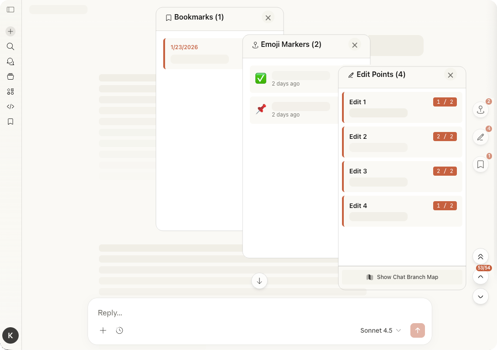
  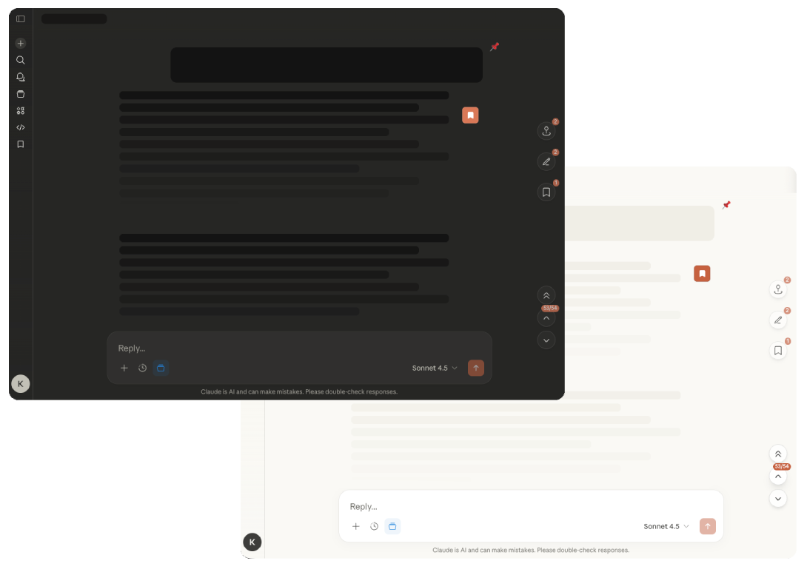
</p>

## Why It Exists

If you use Claude for coding, research, writing, or planning, long chats become hard to scan fast.
Claude Leaf gives you lightweight controls directly inside the conversation so you can:

- move between messages without hunting through the page
- bookmark important parts of a thread
- tag messages with emoji markers for quick visual scanning
- inspect edited prompts and version branches when a conversation evolves

## What You Can Use Today

### Navigation

Move up and down a conversation with floating controls and a live counter so you always know where you are.

<p>
  
</p>

### Bookmarks

Save important messages, organize them, and jump back when you need context again.

<p>
  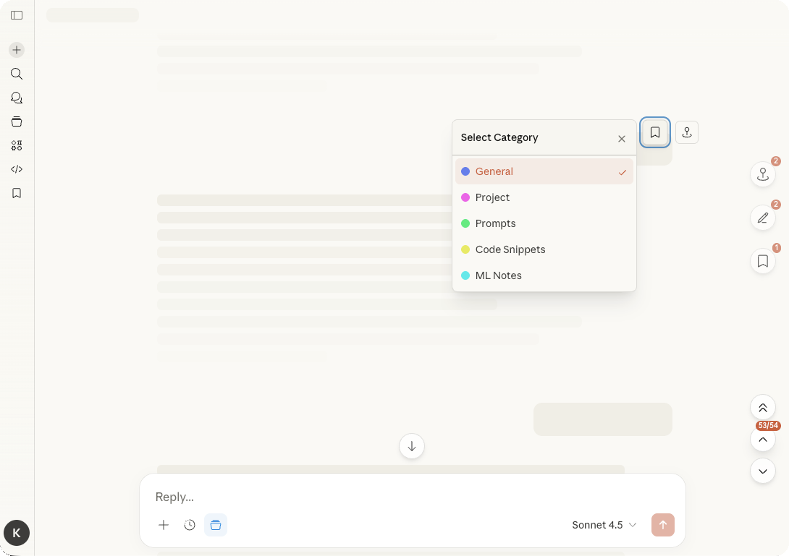
  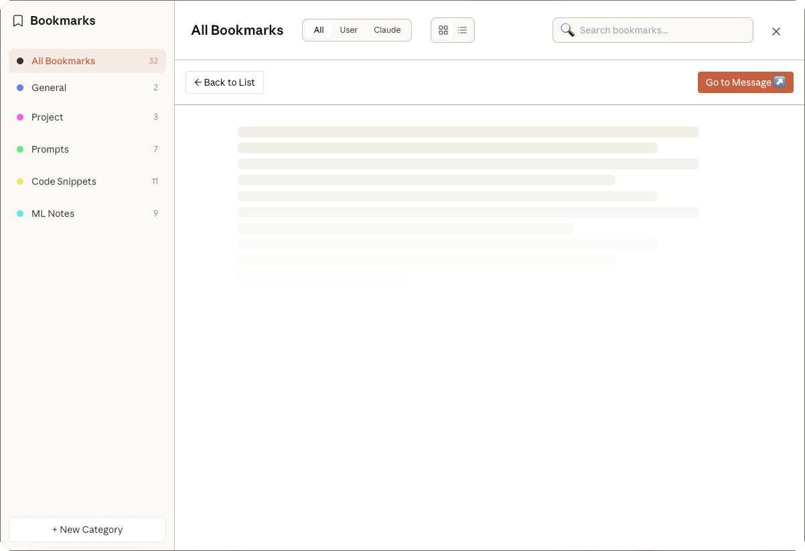
</p>

### Emoji Markers

Mark messages with lightweight visual tags so key answers stand out during long sessions.

<p>
  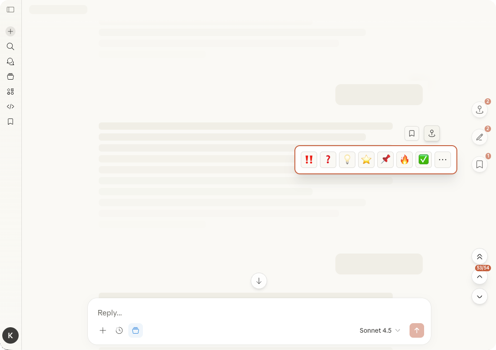
  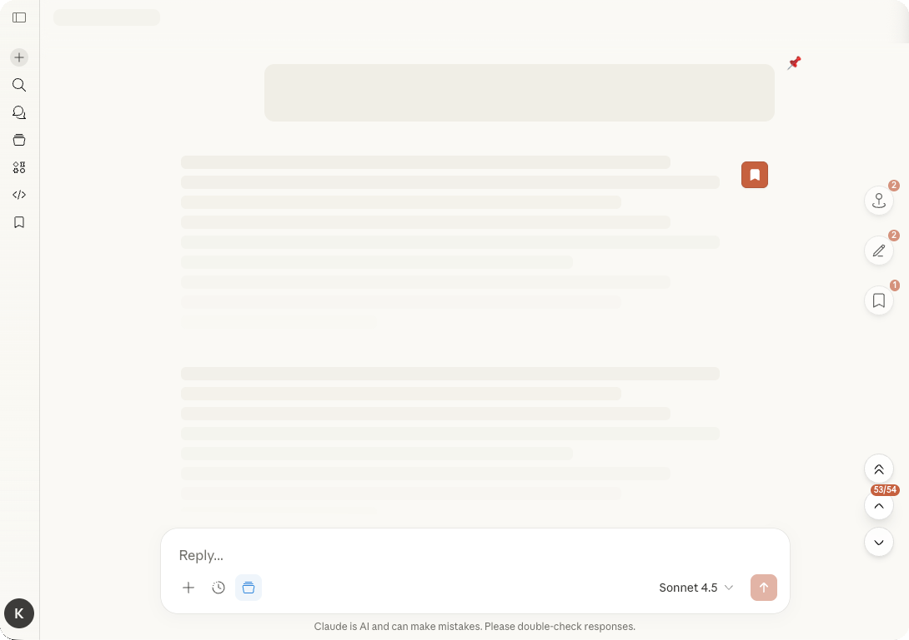
</p>

<p>
  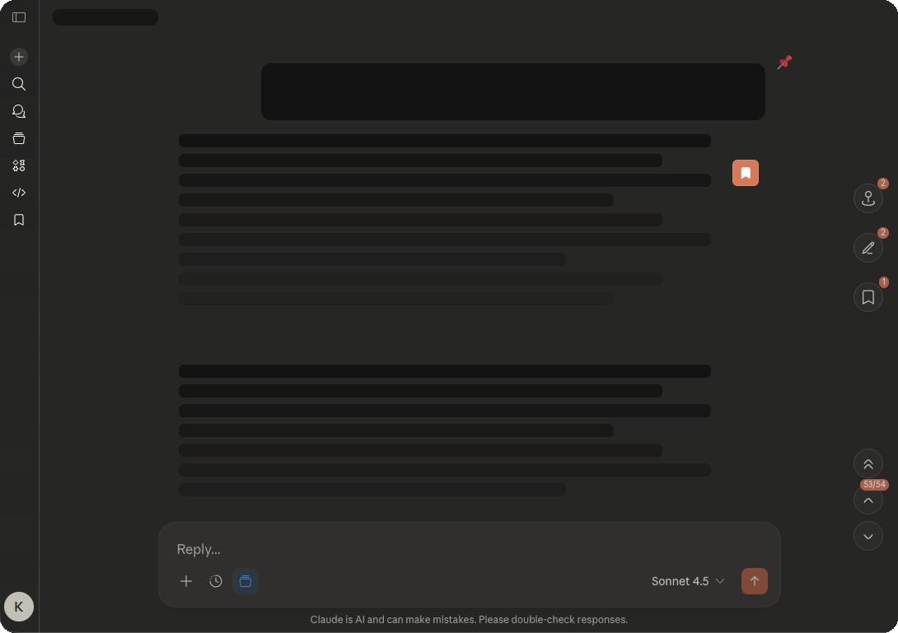
</p>

### Edit History

See how prompts changed over time, inspect versions, and understand branching paths in edited conversations.

<p>
  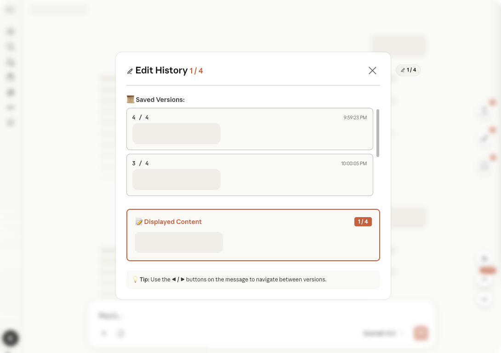
  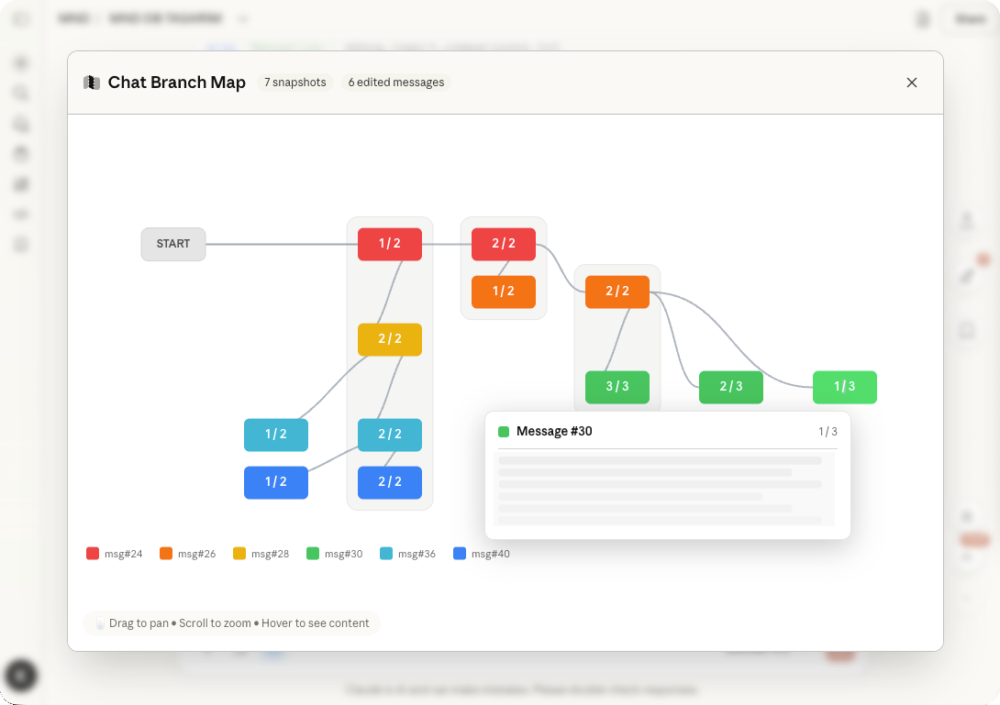
</p>

## Visual Tour

<p>
  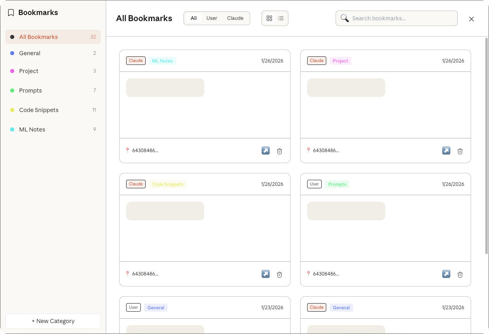
  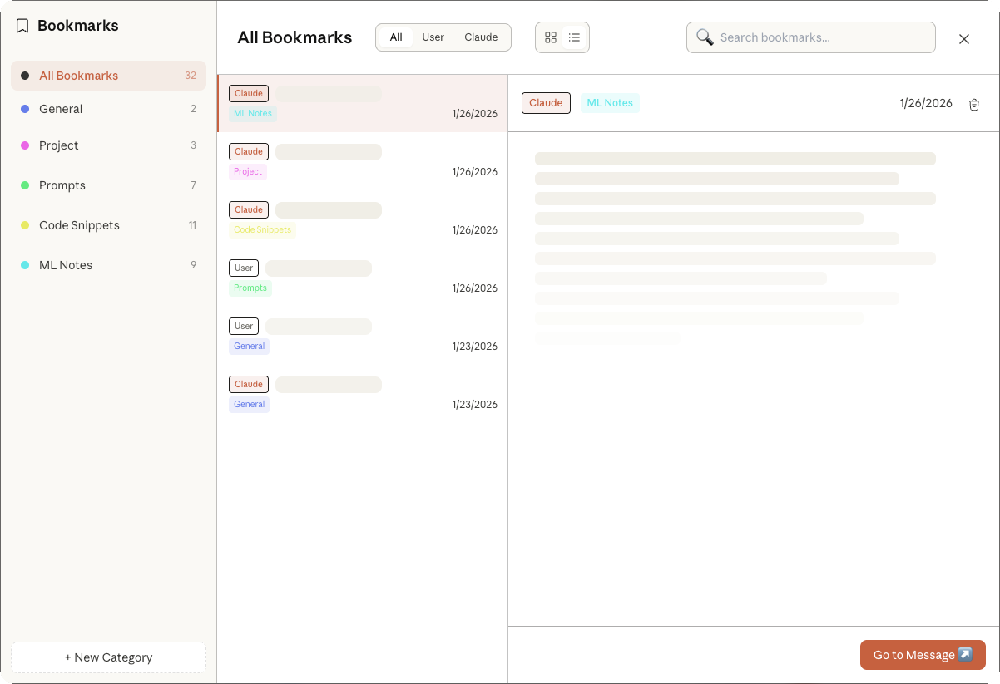
  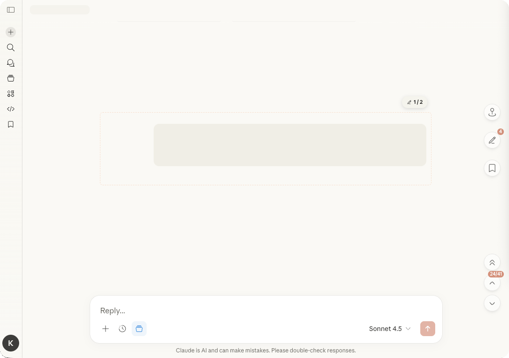
</p>

## In Development

These modules exist in the codebase but are not enabled in the current build:

- **Compact View** for collapsing long responses
- **Content Folding** for headings and code blocks
- **Sidebar Collapse** for cleaner sidebar navigation

## Installation

### From Source

1. Clone the repository.

   ```bash
   git clone https://github.com/kadirkatirci/claude-leaf.git
   cd claude-leaf
   ```

2. Install dependencies and build the extension.

   ```bash
   npm install
   npm run build
   ```

3. Open `chrome://extensions`.
4. Enable `Developer mode`.
5. Click `Load unpacked`.
6. Select the project folder.
7. Open [claude.ai](https://claude.ai).

## Current Module Set

Available in the current build:

- Navigation
- Bookmarks
- Emoji Markers
- Edit History

Present but dev-disabled:

- Compact View
- Content Folding
- Sidebar Collapse

## Development

```bash
npm run dev      # Watch mode with auto-rebuild
npm run build    # Production build
npm run lint     # Run ESLint
npm run lint:fix # Fix ESLint issues
npm run format   # Format with Prettier
```

### Project Structure

```text
src/
├── content.js
├── App.js
├── core/
├── modules/
├── stores/
├── managers/
├── utils/
└── config/

popup/
docs/
icons/
```

For architecture and internal development notes, see [CLAUDE.md](CLAUDE.md).

## Contributing

If you want to contribute, start here:

1. Fork the repository.
2. Create a branch: `git checkout -b feature/your-feature`
3. Make your changes.
4. Run `npm run lint:fix`
5. Open a pull request.

Please also read [CONTRIBUTING.md](CONTRIBUTING.md).

## License

MIT License. See [LICENSE](LICENSE).
